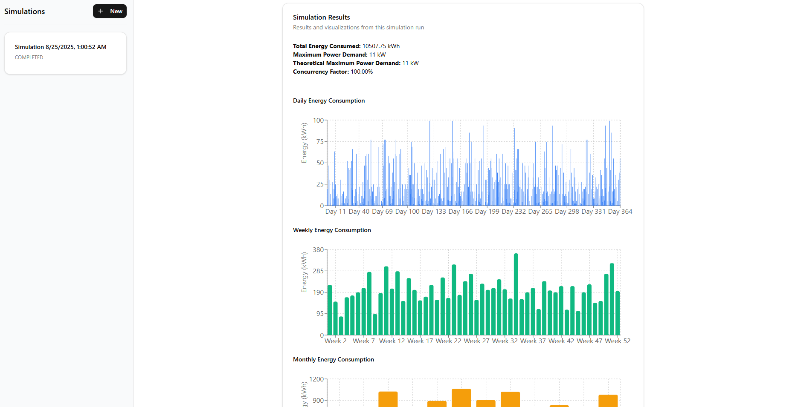

# EV Simulation



A live version of this project is hosted at [https://ev.ribarich.me](https://ev.ribarich.me).

Instructions to run the project locally are below in "Building the project".

This is a monorepo with 3 packages: `simulation`, `simui`, and `simapi`.

The specification document says that the `simulation` logic doesn't need to be connected with the frontend and backend, but I connected it because it sounded like fun :).

The core simulation logic is written in the `simulation` package, which is a native Node.js addon written in C++, which makes it very easy to use from a Node.js Express server:

``` javascript
simulate({
    arrivalDistribution,
    chargingDemandProbabilities,
    chargers: chargers,
    evConsumption: 18
}, (results) => {
    // Do something with results
}
```

A complete example showing the usage and that answers questions from Task 1 is in [example.js](./packages/simulation/example.js).

The `simulation` package is multi threaded, and it uses `libuv` (Node.js event loop implementation) threadpool. Multithreading is not necessary for this simulation, but it demonstrates nicely how multithreading could be handled for a more complex simulation.

The core simulation logic is very simple. This is the code that actually executes the simulation:

``` c++
void Worker::run() {
  for (int tick = 0; tick < Worker::totalTicks; tick++) {
    for (auto &charger : chargersState) {
      if (!charger.occupied) {
        bool evArrived = rand.evArrives(tick);

        if (evArrived) {
          workerState[tick].numOfEvents++;
        }

        if ((charger.occupied = evArrived)) {
          demand_t demand = rand.demand();
          charger.demandKwh = demandToKwh(demand);
        }
      }

      // Consume energy if charger is occupied and there is demand
      if (charger.occupied && charger.demandKwh > 0.0) {
        double energyGenerated = charger.powerKw * (TICK_DURATION / 60.0);
        charger.demandKwh -= energyGenerated;

        workerState[tick].totalEnergyKwh += energyGenerated;
        workerState[tick].totalPowerKw += charger.powerKw;
      }

      if (charger.demandKwh <= 0.0) {
        // Car leaves.
        charger.occupied = false;
        charger.demandKwh = 0.0;
      }
    }
  }
}
```

The frontend is developed with Next.js, Apollo Client, Tailwind, TypeScript and Shadcn. It is located in the package `simui`.

The backend is developed with Apollo Server, Express, TypeScript, Prisma, and Pothos. It is located in the package `simapi`.

The Prisma schema (located in `simapi` package) is the single source of truth for types. To ensure type safety and consistency across Prisma, backend GraphQL and frontend GraphQL, I use Pothos to generate the GraphQL schema and GraphQL Code Generation to create frontend TypeScript from that schema. Although of course for a project for this size, just manually writing types multiple times would've worked fine.

## Answers

### Correlation between concurrency factor and number of chargers

Running the simulation for between 1 and 30 chargers yields the following results:

| Chargers | Theoretical Max Power (kW) | Actual Max Power (kW) | Concurrency Factor |
|----------|----------------------------|-----------------------|--------------------|
| 1        | 11                         | 11.00                 | 1.0000             |
| 2        | 22                         | 22.00                 | 1.0000             |
| 3        | 33                         | 33.00                 | 1.0000             |
| 4        | 44                         | 44.00                 | 1.0000             |
| 5        | 55                         | 55.00                 | 1.0000             |
| 6        | 66                         | 66.00                 | 1.0000             |
| 7        | 77                         | 77.00                 | 1.0000             |
| 8        | 88                         | 88.00                 | 1.0000             |
| 9        | 99                         | 99.00                 | 1.0000             |
| 10       | 110                        | 110.00                | 1.0000             |
| 11       | 121                        | 121.00                | 1.0000             |
| 12       | 132                        | 132.00                | 1.0000             |
| 13       | 143                        | 143.00                | 1.0000             |
| 14       | 154                        | 154.00                | 1.0000             |
| 15       | 165                        | 165.00                | 1.0000             |
| 16       | 176                        | 176.00                | 1.0000             |
| 17       | 187                        | 154.00                | 0.8235             |
| 18       | 198                        | 176.00                | 0.8889             |
| 19       | 209                        | 198.00                | 0.9474             |
| 20       | 220                        | 220.00                | 1.0000             |
| 21       | 231                        | 190.60                | 0.8251             |
| 22       | 242                        | 176.00                | 0.7273             |
| 23       | 253                        | 179.40                | 0.7091             |
| 24       | 264                        | 220.00                | 0.8333             |
| 25       | 275                        | 187.00                | 0.6800             |
| 26       | 286                        | 198.00                | 0.6923             |
| 27       | 297                        | 219.80                | 0.7401             |
| 28       | 308                        | 264.00                | 0.8571             |
| 29       | 319                        | 227.20                | 0.7122             |
| 30       | 330                        | 220.00                | 0.6667             |

### Seeding probabilities

The seed for probabilities is hardcoded in [worker.hpp](/packages/simulation/include/worker.hpp). The simulation code could be extended so that a seed number could be provided through the UI or parameter. This ensures random but deterministic runs of the simulation, depending on the seed.

## Building the project

I tested this project on Linux.

Requirements:
- cmake version >= 3.31
- A modern C++ compiler (tested with GCC)
- Node.js (tested with nvm and Node v22.18.0)
- pnpm
- docker

Clone the repository.

``` sh
git clone git@github.com:ribaricplusplus/reonic-simulation.git
cd reonic-simulation
```

Install dependencies for all packages.

``` sh
pnpm install
```

Run PostgreSQL.

``` sh
docker compose up -d
```

Build the project.

``` sh
pnpm build
```

Start backend and frontend

``` sh
pnpm start
```

For development you can run `pnpm dev` instead of `pnpm start`.
